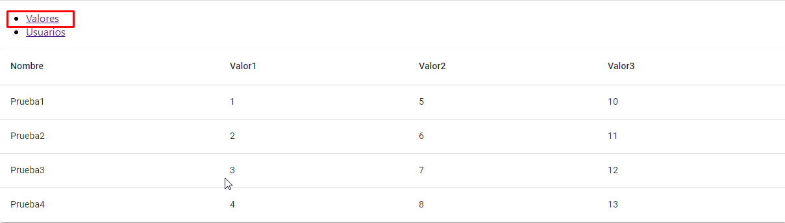
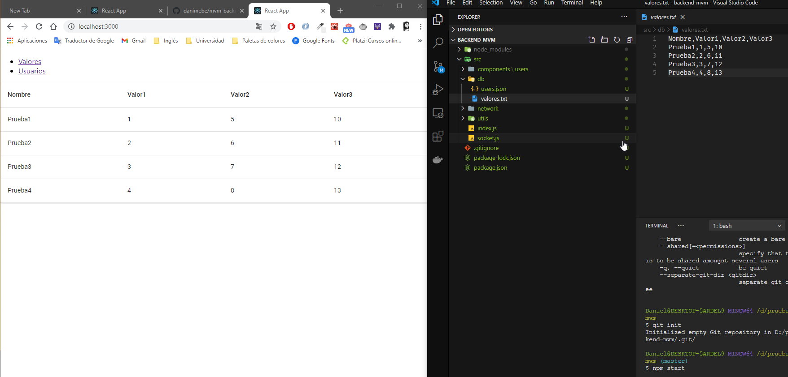
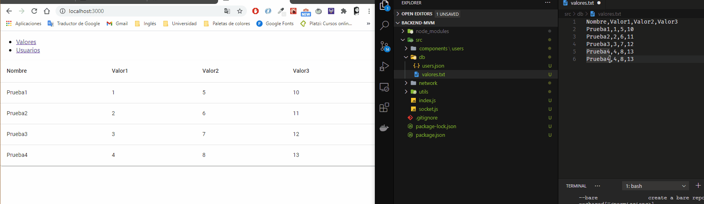
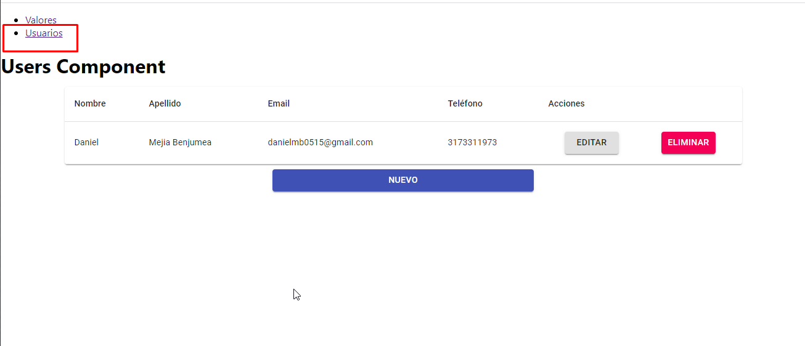

# Frontend prueba node-react MVM - Daniel Mejia Benjumea

Este proyecto es la solución del lado del frontend a la prueba para el cargo de desarrollador node/react en la empresa MVM Ingeniería de software

## Correr el proyecto

1. Descargar o clonar el proyecto
2. para que el proyecto funcione es necesario tener corriendo el proyecto del backend en el puerto 3001 (https://github.com/danimebe/mvm-backend)
3. una vez con el backend corriendo podemos ejecutar el siguiente comando `npm install` para instalar las dependencias necesarias para correr el programa
4. una vez instaladas las dependencias ejecutamos el comando `npm start` para correr la aplicación en el puerto 3000

## Modulos

### Valores

1. En este modulo, se muestran en tiempo real los valores que han sido agregados al archivo "valores.txt" del back, este archivo se encuentra en la ruta `src/db/valores.txt` del proyecto del backend

2. Este componente está conectado al backend siguiendo el protocolo websocket, por lo cual cuando actualicemos el archivo `src/db/valores.txt` este componente se debería actualizar en tiempo real (al momento de guardar el archivo).

    - Antes de actualizar el archivo
    
    - Al agregar una fila al archivo "valores.txt" y guardar se debe actualizar automaticamente
    

### Usuarios

1. En este modulo podemos usar los métodos http (GET, POST, PUT, DELETE) implementados en el back siguiendo cada uno de los botones, estos usuarios quedan guardados en el archivo `src/db/users.json` del proyecto backend

